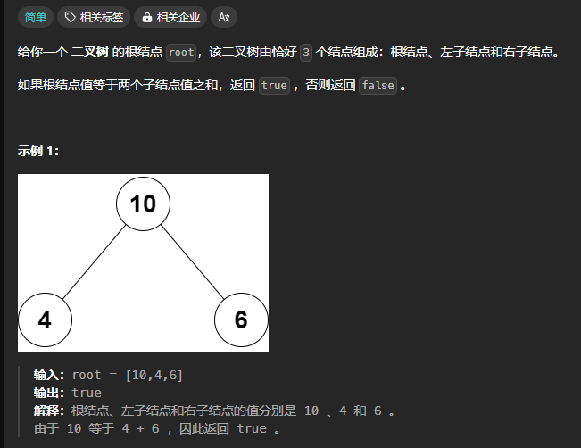

# README


## 1.题目

### 1.两数之和

给定一个整数数组 `nums` 和一个整数目标值 `target`，请你在该数组中找出 **和为目标值** *`target`* 的那 **两个** 整数，并返回它们的数组下标。

你可以假设每种输入只会对应一个答案，并且你不能使用两次相同的元素。

你可以按任意顺序返回答案。

 

**示例 1：**

```
输入：nums = [2,7,11,15], target = 9
输出：[0,1]
解释：因为 nums[0] + nums[1] == 9 ，返回 [0, 1] 。
```

**示例 2：**

```
输入：nums = [3,2,4], target = 6
输出：[1,2]
```

**示例 3：**

```
输入：nums = [3,3], target = 6
输出：[0,1]
```

 

**提示：**

- `2 <= nums.length <= 104`
- `-109 <= nums[i] <= 109`
- `-109 <= target <= 109`
- **只会存在一个有效答案**

 

**进阶：**你可以想出一个时间复杂度小于 `O(n2)` 的算法吗？


### 2.两整数相加

给你两个整数 `num1` 和 `num2`，返回这两个整数的和。

 

**示例 1：**

```
输入：num1 = 12, num2 = 5
输出：17
解释：num1 是 12，num2 是 5 ，它们的和是 12 + 5 = 17 ，因此返回 17 。
```

**示例 2：**

```
输入：num1 = -10, num2 = 4
输出：-6
解释：num1 + num2 = -6 ，因此返回 -6 。
```

 

**提示：**

- `-100 <= num1, num2 <= 100`


### 3.温度转换

给你一个四舍五入到两位小数的非负浮点数 `celsius` 来表示温度，以 **摄氏度**（**Celsius**）为单位。

你需要将摄氏度转换为 **开氏度**（**Kelvin**）和 **华氏度**（**Fahrenheit**），并以数组 `ans = [kelvin, fahrenheit]` 的形式返回结果。

返回数组 *`ans`* 。与实际答案误差不超过 `10-5` 的会视为正确答案**。**

**注意：**

- `开氏度 = 摄氏度 + 273.15`
- `华氏度 = 摄氏度 * 1.80 + 32.00`

 

**示例 1 ：**

```
输入：celsius = 36.50
输出：[309.65000,97.70000]
解释：36.50 摄氏度：转换为开氏度是 309.65 ，转换为华氏度是 97.70 。
```

**示例 2 ：**

```
输入：celsius = 122.11
输出：[395.26000,251.79800]
解释：122.11 摄氏度：转换为开氏度是 395.26 ，转换为华氏度是 251.798 。
```

 

**提示：**

- `0 <= celsius <= 1000`


### 4.最小偶倍数

给你一个正整数 `n` ，返回 `2` 和 `n` 的最小公倍数（正整数）。

 

**示例 1：**

```
输入：n = 5
输出：10
解释：5 和 2 的最小公倍数是 10 。
```

**示例 2：**

```
输入：n = 6
输出：6
解释：6 和 2 的最小公倍数是 6 。注意数字会是它自身的倍数。
```

 

**提示：**

- `1 <= n <= 150`


### 5.判断根节点是否等于子节点




## 2.树在嵌入式领域中的应用

### 1. **文件系统（文件目录树）**

在嵌入式系统中，文件系统经常使用树结构来组织文件夹和文件。每个节点代表一个文件或文件夹，根节点是根目录，其他节点是子目录或文件。

```
c复制代码#include <stdio.h>
#include <stdlib.h>
#include <string.h>

// 文件节点结构体
struct FileNode {
    char name[100];             // 文件/文件夹的名字
    struct FileNode *left;      // 左子节点，表示第一个子目录
    struct FileNode *right;     // 右子节点，表示下一个文件/文件夹
};

// 创建新文件夹或文件节点
struct FileNode* createFileNode(const char* name) {
    struct FileNode* node = (struct FileNode*)malloc(sizeof(struct FileNode));
    strcpy(node->name, name);  // 设置节点名称
    node->left = node->right = NULL;  // 默认没有子节点
    return node;
}

// 示例：创建文件系统（根目录下有两个文件夹和一个文件）
int main() {
    struct FileNode* root = createFileNode("root");  // 根目录
    struct FileNode* folder1 = createFileNode("folder1");
    struct FileNode* folder2 = createFileNode("folder2");
    struct FileNode* file1 = createFileNode("file1.txt");

    // 构建文件树
    root->left = folder1;      // 根目录的左子节点是文件夹1
    folder1->left = file1;     // folder1下有文件file1.txt
    root->right = folder2;     // 根目录的右子节点是文件夹2

    // 输出文件结构
    printf("Root folder: %s\n", root->name);
    printf("Subfolder: %s\n", root->left->name);
    printf("File in folder1: %s\n", root->left->left->name);
    printf("Subfolder: %s\n", root->right->name);

    return 0;
}
```

### 2. **设备树（Device Tree）**

设备树（Device Tree）是一个描述硬件资源的结构体，在嵌入式Linux中尤其重要。我们可以使用树形结构来表示硬件设备。

```
c复制代码#include <stdio.h>
#include <stdlib.h>

// 设备节点结构体
struct DeviceNode {
    char name[50];              // 设备名
    struct DeviceNode *child;   // 子设备节点
    struct DeviceNode *sibling; // 同级设备节点
};

// 创建设备节点
struct DeviceNode* createDeviceNode(const char* name) {
    struct DeviceNode* node = (struct DeviceNode*)malloc(sizeof(struct DeviceNode));
    strcpy(node->name, name);  // 设置设备名
    node->child = NULL;        // 默认没有子设备
    node->sibling = NULL;      // 默认没有同级设备
    return node;
}

// 示例：创建一个简单的设备树
int main() {
    struct DeviceNode* root = createDeviceNode("Root Device");

    struct DeviceNode* cpu = createDeviceNode("CPU");
    struct DeviceNode* memory = createDeviceNode("Memory");
    struct DeviceNode* uart = createDeviceNode("UART");

    // 构建设备树
    root->child = cpu;
    cpu->sibling = memory;
    memory->sibling = uart;

    // 输出设备树
    printf("Root Device: %s\n", root->name);
    printf("Child Device: %s\n", root->child->name);
    printf("Siblings of CPU: %s, %s\n", root->child->sibling->name, root->child->sibling->sibling->name);

    return 0;
}
```

### 3. **中断向量树（中断管理）**

在嵌入式系统中，中断向量表常常组织成树状结构，用于管理不同的中断源。以下是一个简单的中断树的实现例子。

```
c复制代码#include <stdio.h>
#include <stdlib.h>

// 中断向量节点结构体
struct InterruptNode {
    int interruptID;                  // 中断ID
    void (*handler)(void);             // 中断处理函数
    struct InterruptNode* left;       // 左子树：优先级较高的中断
    struct InterruptNode* right;      // 右子树：优先级较低的中断
};

// 创建中断节点
struct InterruptNode* createInterruptNode(int interruptID, void (*handler)(void)) {
    struct InterruptNode* node = (struct InterruptNode*)malloc(sizeof(struct InterruptNode));
    node->interruptID = interruptID;
    node->handler = handler;
    node->left = node->right = NULL;  // 默认没有子节点
    return node;
}

// 中断处理函数
void handleInterruptA() {
    printf("Handling Interrupt A\n");
}

void handleInterruptB() {
    printf("Handling Interrupt B\n");
}

// 示例：创建一个中断树并调用中断处理
int main() {
    struct InterruptNode* root = createInterruptNode(1, handleInterruptA);  // 根节点是优先级最高的中断
    struct InterruptNode* nodeB = createInterruptNode(2, handleInterruptB); // 低优先级中断

    // 构建中断树：root->left 是优先级更高的中断
    root->right = nodeB;

    // 触发中断并调用对应的处理函数
    if (root->interruptID == 1) {
        root->handler();
    }
    if (root->right->interruptID == 2) {
        root->right->handler();
    }

    return 0;
}
```

### 4. **哈夫曼编码树（数据压缩）**

在嵌入式系统中，哈夫曼编码可以用来压缩数据，减小数据的传输和存储空间。下面是一个简单的哈夫曼树构建和编码的例子。

```
c复制代码#include <stdio.h>
#include <stdlib.h>

// 哈夫曼树节点结构体
struct HuffmanNode {
    char ch;                         // 字符
    int freq;                         // 频率
    struct HuffmanNode *left, *right; // 左右子树
};

// 创建哈夫曼树节点
struct HuffmanNode* createHuffmanNode(char ch, int freq) {
    struct HuffmanNode* node = (struct HuffmanNode*)malloc(sizeof(struct HuffmanNode));
    node->ch = ch;
    node->freq = freq;
    node->left = node->right = NULL;
    return node;
}

// 示例：创建一个简单的哈夫曼树
int main() {
    struct HuffmanNode* root = createHuffmanNode('A', 5);
    struct HuffmanNode* nodeB = createHuffmanNode('B', 3);
    struct HuffmanNode* nodeC = createHuffmanNode('C', 8);

    // 构建哈夫曼树
    root->left = nodeB;  // 左子树是B
    root->right = nodeC; // 右子树是C

    // 输出哈夫曼树结构
    printf("Huffman Tree:\n");
    printf("Root: %c, Frequency: %d\n", root->ch, root->freq);
    printf("Left Child: %c, Frequency: %d\n", root->left->ch, root->left->freq);
    printf("Right Child: %c, Frequency: %d\n", root->right->ch, root->right->freq);

    return 0;
}
```

### 5. **二叉搜索树（BST）**

在嵌入式系统中，二叉搜索树常用于实现高效的数据存储和查找。以下是一个简单的二叉搜索树实现，能够插入节点并查找值。

```
c复制代码#include <stdio.h>
#include <stdlib.h>

// 二叉搜索树节点结构体
struct BSTNode {
    int val;                      // 节点值
    struct BSTNode* left;         // 左子树
    struct BSTNode* right;        // 右子树
};

// 创建新节点
struct BSTNode* createBSTNode(int val) {
    struct BSTNode* node = (struct BSTNode*)malloc(sizeof(struct BSTNode));
    node->val = val;
    node->left = node->right = NULL;
    return node;
}

// 插入节点
struct BSTNode* insert(struct BSTNode* root, int val) {
    if (root == NULL) {
        return createBSTNode(val);
    }
    if (val < root->val) {
        root->left = insert(root->left, val);
    } else {
        root->right = insert(root->right, val);
    }
    return root;
}

// 查找节点
struct BSTNode* search(struct BSTNode* root, int val) {
    if (root == NULL || root->val == val) {
        return root;
    }
    if (val < root->val) {
        return search(root->left
```

